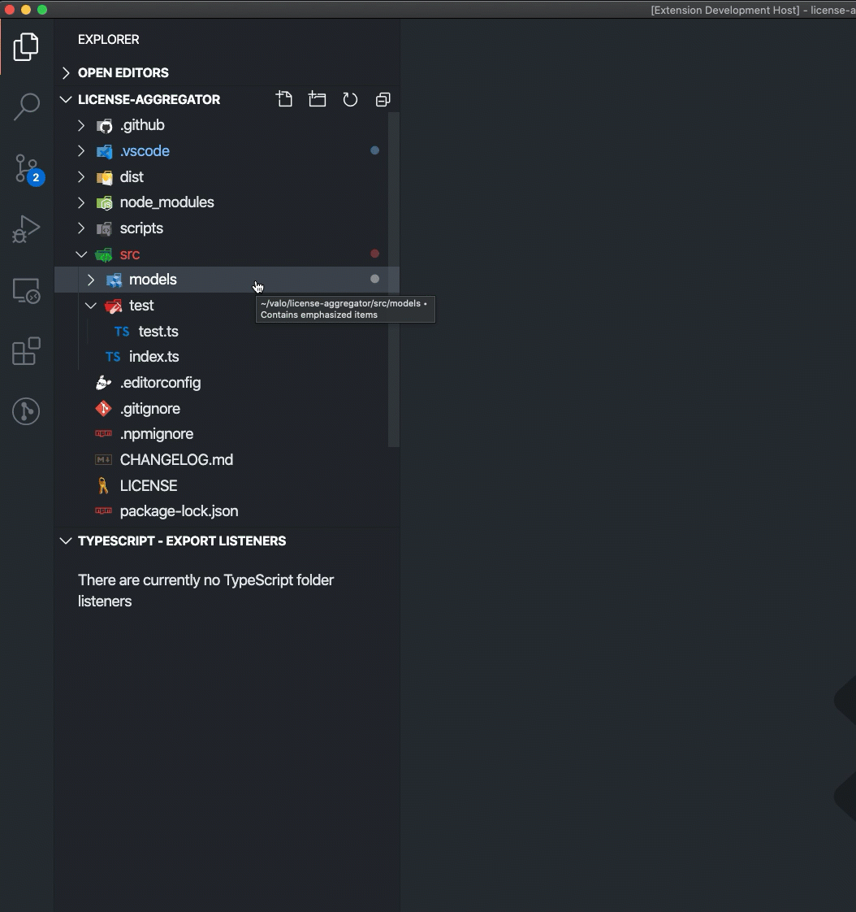
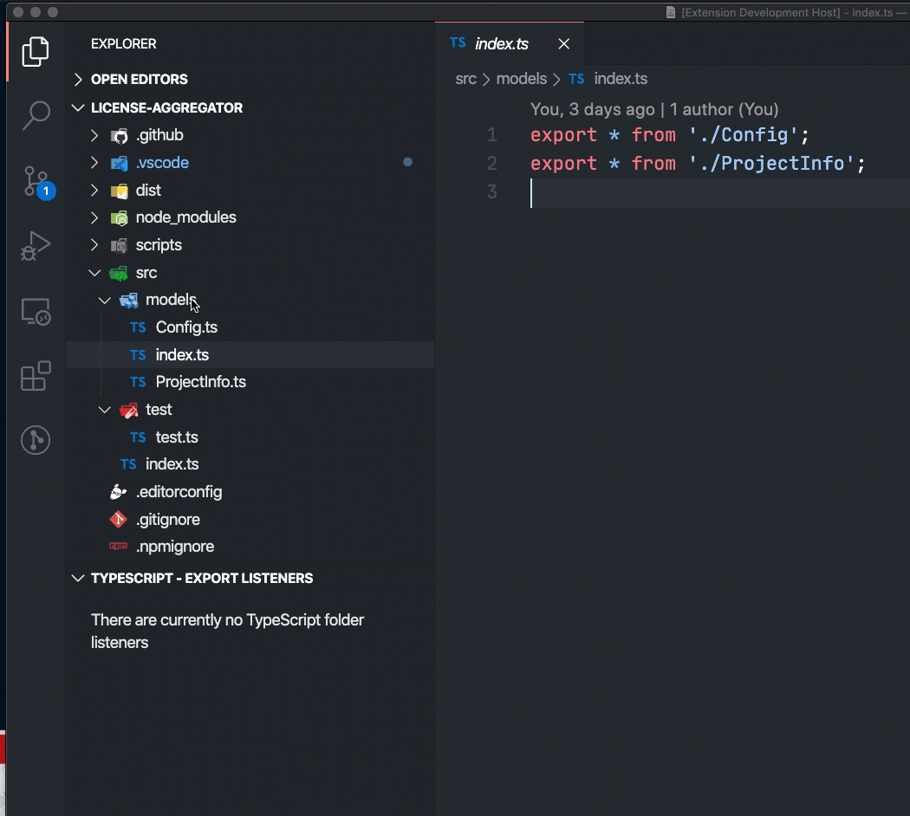
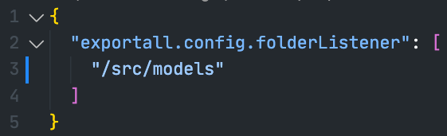

# TypeScript Export All Modules 

&nbsp;&nbsp;

&nbsp;&nbsp;

Working with TypeScript? Want to make your TypeScript imports cleaner? Use this extension to easily export all modules from a specific directory via a `index.ts` file.

## Functionalities

This extension allows you to manually create a module export or to set a folder listener. With the folder listerener, the `index.ts` will automatically get updated once a file gets added/updated/deleted.

### Manual creation

### Module creation by listener

## Configuration

The configuration of the folder listeners is stored under the following setting: `exportall.config.folderListener`. This is an array of the relative folder paths in for the current workspace.

## Contribute

Experiencing any issues, or got feedback to share? Feel free to raise this in the issue list of the repo: [issues](https://github.com/estruyf/vscode-typescript-exportallmodules/issues).