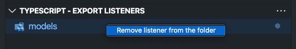
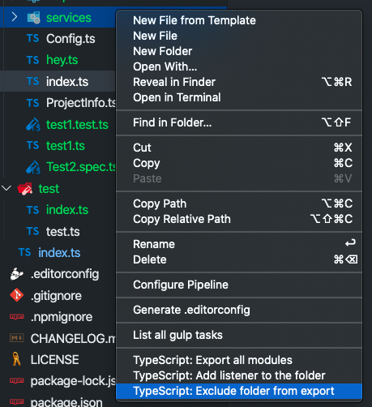
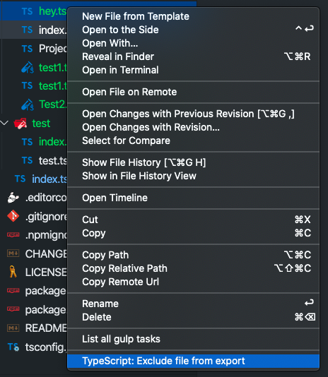
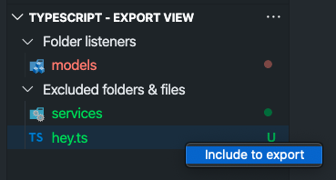

<h1 align="center">
  <a href="https://marketplace.visualstudio.com/items?itemName=eliostruyf.vscode-typescript-exportallmodules">
    
  </a>
</h1>

<h2 align="center">TypeScript Barrel Generator</h2>

<p align="center">
  <a href="https://marketplace.visualstudio.com/items?itemName=eliostruyf.vscode-typescript-exportallmodules" title="Check it out on the Visual Studio Marketplace">
    
  </a>

  
  
  

  <a href="https://www.buymeacoffee.com/zMeFRy9" title="Buy me a coffee" style="margin-left:10px">
    
  </a>
</p>

## ❓ Why

Working with TypeScript? Want to make your TypeScript imports cleaner? Use this extension to easily export all modules to a barrel `index.ts` file.

> **Info**: A "barrel" is a way to rollup exports from several modules into a single convenient module. The barrel itself is a module file that re-exports selected exports of other modules.

Example: 

```typescript
// folder/index.ts
export * from './foo';
export * from './bar';
```

## ✨ Functionalities

The extension allows you to manually or automatically export the modules to a barrel file. For the automatic way, you first have to create a listener for the folder for which you want to create the automated export. 

In both the manual and automatic way, an `index.ts` file will be created with a reference to all the folder/files in the current directory.

> **Info**: If there are folders/files you want to get excluded from the export, you can do this by right-clicking on the folder/file and clicking on the `TypeScript: Exclude folder/file from export`.

### Manual creation

<p align="center">
  
</p>

### Module creation by listener

<p align="center">
  
</p>

> **Info**: When a folder listener is added, it will be visible in the `TypeScript - Export Listeners` view. By clicking on the folder names, you will automatically open the `index.ts` file.

#### Removing a listener

Folder listeners can be removed by right-clicking on the folder name in the `TypeScript - Export View`.

<p align="center">
  
</p>

### Excluding folder(s)/file(s)

If there are specific folders or files you want to exclude from your module, you can do this by right-clicking on the file, and click on the `TypeScript: Exclude folder/file from export` menu action.

<p align="center">
  
</p>

<p align="center">
  
</p>

#### Include previously excluded folder(s)/file(s)

When you already excluded a folder or file, and want to include these again into your module export, you can do this from the `TypeScript - Export View`. Under the `Excluded folders & files` section, right-click on the folder or file to include and click `Include to export`.

<p align="center">
  
</p>

## ⚙️ Configuration / Settings

The extension makes use of the following settings:

| Setting | Description | Type | Default |
| --- | --- | --- | --- |
| `exportall.config.includeFoldersToExport` | Specifies if folder (which contain a `index.ts` file) will also be included in the module export. | boolean | `true` |
| `exportall.config.exclude` | Specify which files you want to exclude the `index.ts` file. Works on the whole filename or part of the filename. | string[] | `['.test.', '.spec.']` |
| `exportall.config.folderListener` | Specify the relative paths for the folder listeners. This will make it possible to automatically generate the module export once a file gets added/updated/removed within the specified folder. | string[] | `[]` |
| `exportall.config.relExclusion` | Specify the relative folder/file paths to exclude from the export. | string[] | `[]` |
| `exportall.config.semis` | Specify if you want to enable/disable the usage of semis in the barrel file. | boolean | `true` |
| `exportall.config.quote` | Specify the character that you want to use as the quoting character; typically `'` or `"`. | string | `'` |

<p align="center">
  
</p>

## 💪 Contribute

Experiencing any issues, or got feedback to share? Feel free to raise this in the issue list of the repo: [issues](https://github.com/estruyf/vscode-typescript-exportallmodules/issues).

## 🔑 License

[MIT](./LICENSE)

<br />
<br />

<p align="center">
  <a href="https://visitorbadge.io/status?path=https%3A%2F%2Fgithub.com%2Festruyf%2Fvscode-typescript-exportallmodules"></a>
</p>